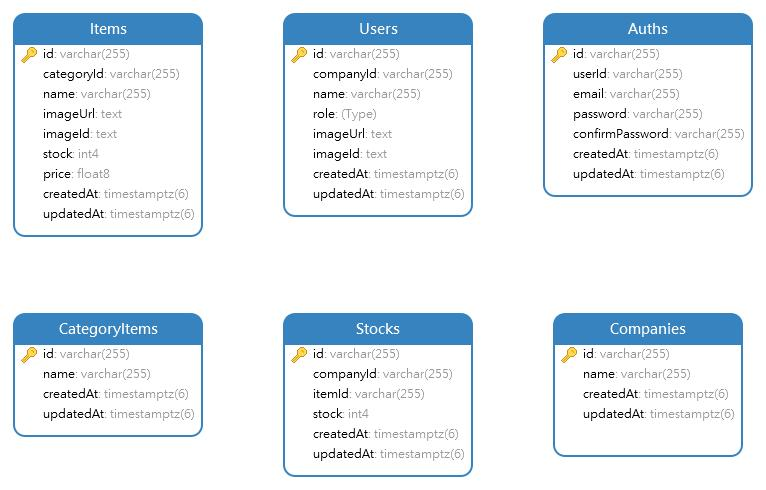

# [VIERY TEST] THR Lebaran Mini Challenge 4 Team-03

## Database Structure

     

# API Documentation

<a href="https://documenter.getpostman.com/view/22814931/2sA35LUyo4" target="_blank" title="Postman Documentation"/>

[READ HERE](#)

# EndPoint

### API

#### - Users

| METHOD | End Point         | Deskripsi                            | params | keterangan |
| ------ | ----------------- | ------------------------------------ | ------ | ---------- |
| GET    | /api/v1/users     | mendapatkan semua data users         | [-]    |            |
| GET    | /api/v1/users/:id | mendapatkan data user berdasarkan ID |        |            |
| DEL    | /api/v1/users/:id | menghapus data user                  |        |            |
|        |                   |                                      |        |            |

#### - Auth

| METHOD | End Point           | Deskripsi              | params | catatan     |
| ------ | ------------------- | ---------------------- | ------ | ----------- |
| GET    | /api/v1/me          | mendapatkan data login | [-]    | harus login |
| POST   | /api/v1/login       | melakukan login        |        |             |
| POST   | /api/v1/register    | melakukan register     |        | harus login |
| PUT    | /api/v1/profile/:id | edit data user login   |        | harus login |
|        |                     |                        |        |

### Web Page

| End Point | Deskripsi | link             |
| --------- | --------- | ---------------- |
| /         | -         | http://localhost |

# Data Team 3

|                      |                           |
| -------------------- | ------------------------- |
| **Anggota Tim 03**   | _Reinanda Faris_          |
|                      | _Rizaldi Mustakim_        |
|                      | _Viery Nugroho_           |
|                      | _Asyifa Maharani Gustina_ |
|                      | _Qonita Afifah_           |
|                      |                           |
| **Kelas**            | _FSW 1_                   |
|                      |                           |
| **ID Fasil**         | _F-FSW24001086_           |
| **Nama Fasilitator** | _Imam Taufiq Hermawan_    |
|                      |                           |

# Fullstack Web Development

### KM x Binar Academy Batch 6

|                                   |
| --------------------------------- |
| **Catatan**                       |
| Mini Challenge - Stock Management |

# Langkah Install

-   npm install
-   migration
-   seeding
-   testing

# TABEL DETAIL

create user data on auth_controller

1. register: Company.companyId -> Create User -> Create Auth
2.

<!--! Update  -->

perubahan table company dan users
company tidak memakai users_id

<!-- ? ROLE  -->
<!-- TODO: superAdmin -->
<!-- TODO: admin -->

-   mempunyai shop ID
-   bisa register (create user)
-   crud stock company item

<!-- TODO: user -->

-   cuma bisa login
-   read data stock
